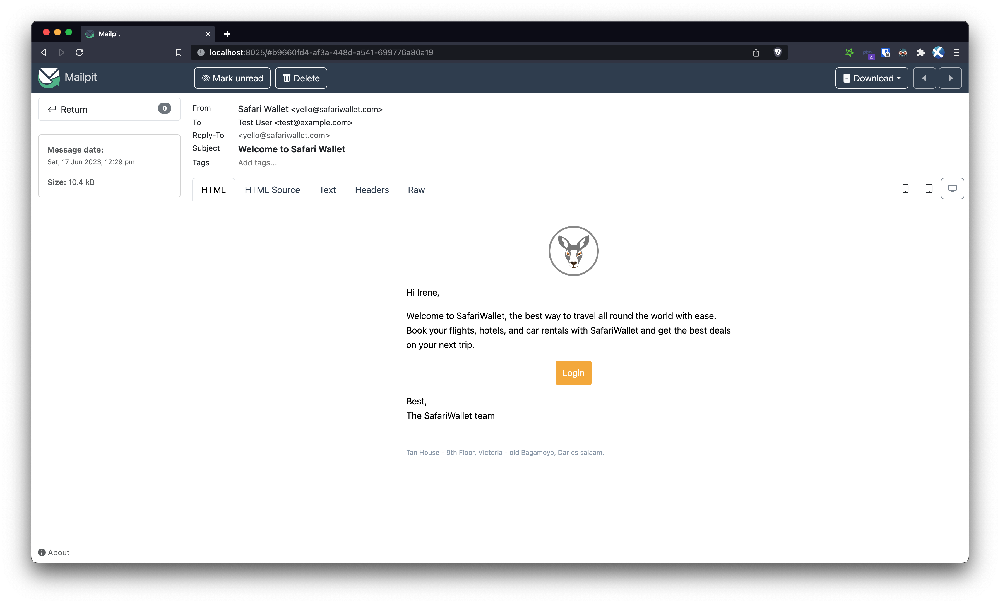

# laravel using React Emails 

Uses `React` to **render** emails in `Laravel` 10




## Technologies

- Laravel 10
- [laravel-react-email](https://github.com/maantje/laravel-react-email) - Allows you to easily send React email emails with Laravel.
- [React Email](https://react.email/) - A collection of high-quality, unstyled components for creating beautiful emails using React and TypeScript.

## Why 

<small>Well, why not?</small>

As a dev, I wanted to use React in designing emails. 

- maintaining a separate repo for emails is a pain. (gets out of sync quickly)
- Having to use a separate service to send emails is a pain. (gets expensive quickly) 
- Having many emails can get unmanageable. (gets out of hand quickly)


- Having organized components and a familiar syntax is a huge plus.
- The syntax is familiar and the components are reusable.


## Getting started


```bash
# 🧑‍💻 Happy hacking! 
```
